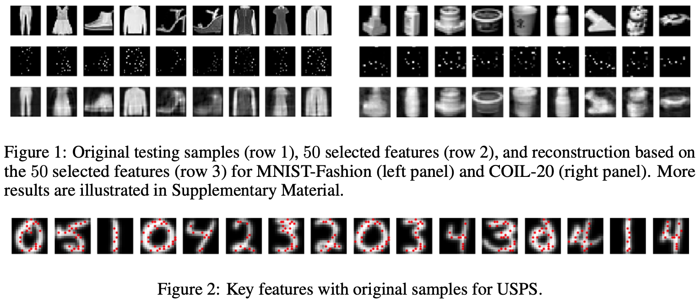
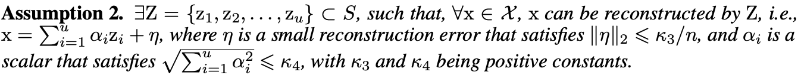
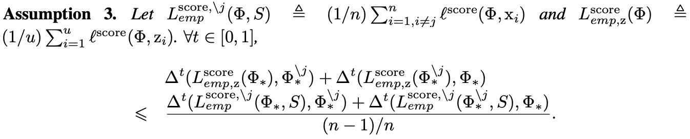
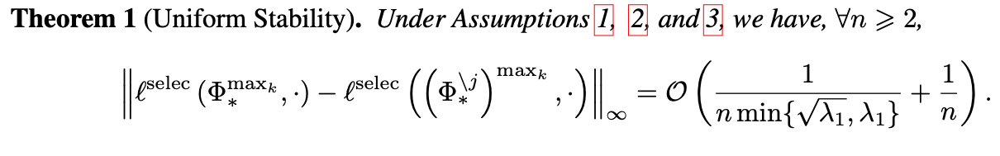
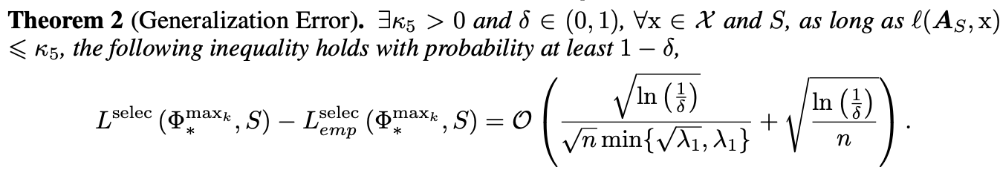
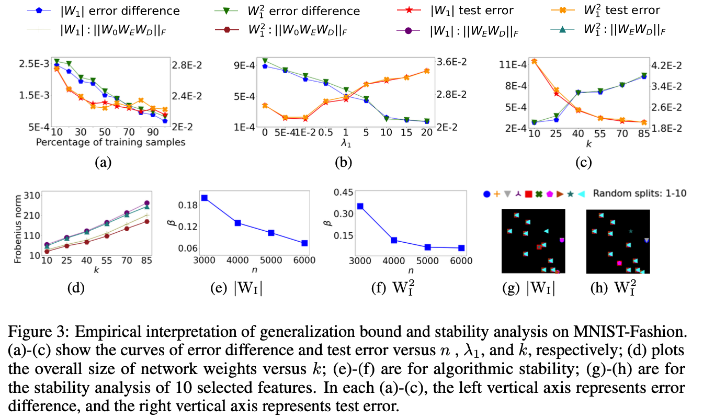
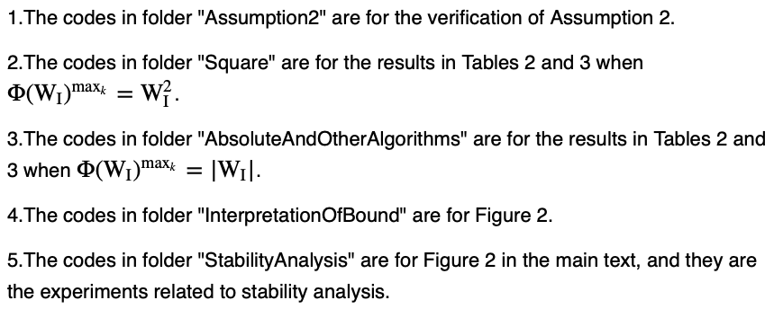
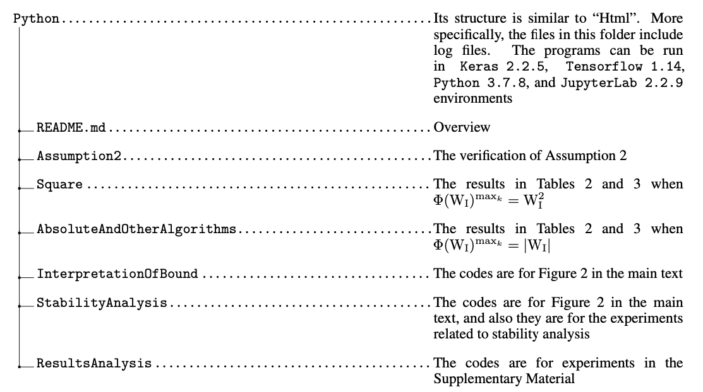

# Algorithmic Stability and Generalization of an Unsupervised Feature Selection Algorithm (**NeurIPS 2021**) 

Paper link: https://proceedings.neurips.cc/paper/2021/hash/a546203962b88771bb06faf8d6ec065e-Abstract.html

---

> Feature selection, as an important dimension reduction technique, reduces data dimension by identifying an essential subset of input features, which can facilitate interpretable insights into learning and inference processes. Algorithmic stability is a key characteristic of an algorithm regarding its sensitivity to perturbations of input samples. In this paper, we propose an innovative unsupervised feature selection algorithm attaining this stability with provable guarantees. The architecture of our algorithm consists of a feature scorer and a feature selector. The scorer trains a neural network (NN) to globally score all the features, and the selector adopts a dependent sub-NN to locally evaluate the representation abilities for selecting features. Further, we present algorithmic stability analysis and show that our algorithm has a performance guarantee via a generalization error bound. Extensive experimental results on real-world datasets demonstrate superior generalization performance of our proposed algorithm to strong baseline methods. Also, the properties revealed by our theoretical analysis and the stability of our algorithm-selected features are empirically confirmed.

---
Taking MNIST-Fashion, COIL-20, and USPS as examples, for $k = 50$ and $\Phi^{\mathrm{max}_k}=(\mathrm{W}_{\mathrm{I}}^2)^{\mathrm{max}_k}$, we visualize the feature selection and reconstruction results on MNIST demonstrated in Figure 1, and we give the selected features on original samples of USPS in Figure 2.

---
## Assumptions

---
## Theoretical results

---

---

We empirically verify the properties related to uniform stability bound and generalization bound in Theorems 1 and 2. Further, we will discuss the algorithmic stability and the stability of selected features by our algorithm.

---
## Codes

All experiments are implemented by JupyterLab 2.2.4 with Python 3.7.8, Tensorflow 1.14, and Keras 2.2.5. The files in the subfolder “Python” are the Python source codes, which have been implemented in JupyterLab. For readability, we also provide the corresponding html files in the subfolder “Html”.

---
## How to cite

**If you find this code useful in your research, please consider citing our work:**

Xinxing Wu and Qiang Cheng. Algorithmic stability and generalization of an unsupervised feature selection algorithm. Thirty-fifth Conference on Neural Information Processing Systems (NeurIPS 2021), https://proceedings.neurips.cc/paper/2021/hash/a546203962b88771bb06faf8d6ec065e-Abstract.html; preprint arXiv: 2010.09416, 2021, https://arxiv.org/abs/2010.09416

---

## License

Distributed under the MIT license. See [``LICENSE``](https://github.com/xinxingwu-uk/UFS/blob/main/LICENSE) for more information.

---

## Contacts

Xinxing Wu (xinxingwu@gmail.com) and Qiang Cheng (qiang.cheng@uky.edu)
